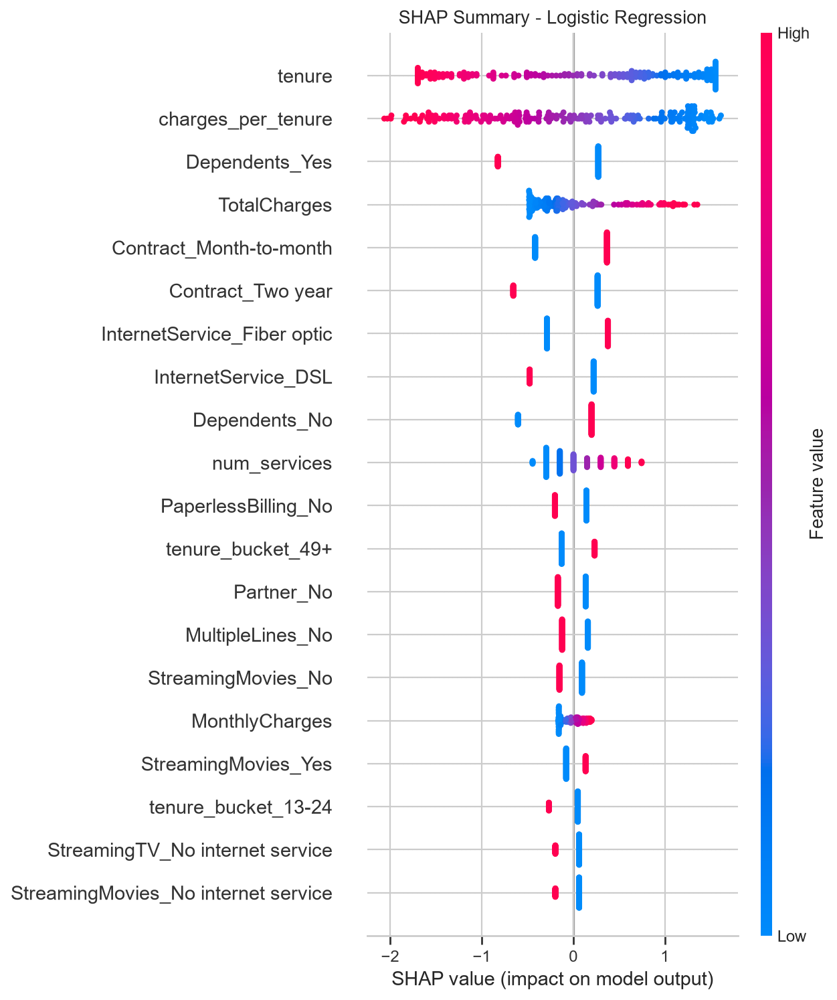
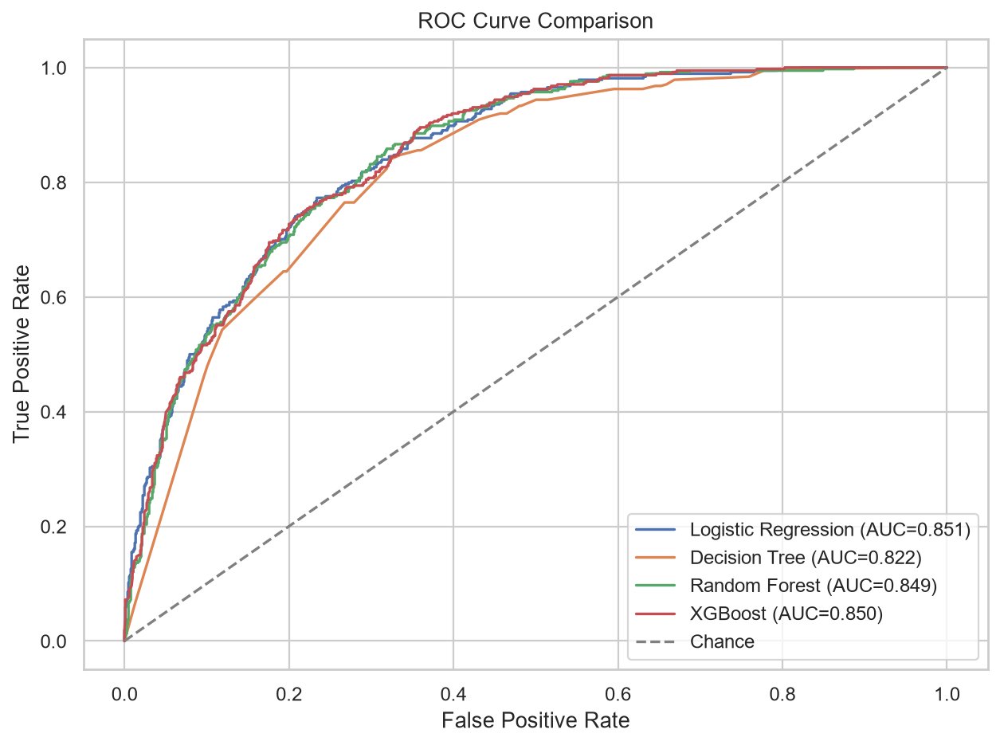
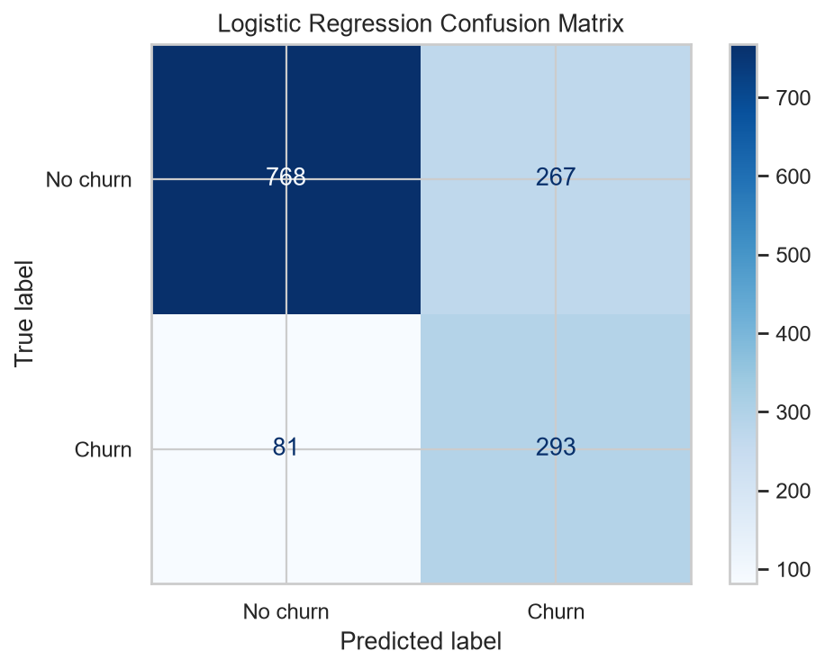

# Customer Churn Prediction Pipeline

## Problem Statement
Customer churn prediction helps retention teams identify customers who are likely to leave before they cancel service. This project builds an end-to-end machine learning workflow that turns Telco customer records into churn probabilities and business-ready drivers.

## Dataset
Source: IBM Telco Customer Churn dataset, expected first at `data/raw/Telco-customer-churn.csv`.
Rows used: 7,043. The real IBM Telco Customer Churn CSV was used from data/raw/.
The raw CSV is not committed to this repository. Add the IBM Telco CSV to `data/raw/` before running the pipeline, or run without it to use the built-in synthetic fallback.

## Approach
The pipeline cleans raw customer records, runs EDA and hypothesis tests, engineers derived features, performs stratified train/test splitting, optionally applies SMOTE to the training set, trains four classifiers, evaluates them with churn-focused metrics, and uses SHAP to explain the recommended model.

## Project Structure
- `src/` - pipeline modules (data loading, EDA, feature engineering, resampling, training, evaluation, interpretation)
- `tests/` - unit tests for feature engineering, resampling, data loader fallback, and pipeline outputs
- `reports/` - generated metrics, figures, and findings from pipeline runs
- `models/` - saved trained models
- `app.py` - Streamlit demo app

## Key Findings
See `reports/eda_findings.md` and `reports/business_insights.md` for the generated findings. Highlights include contract type, payment method, internet service type, tenure, and monthly cost patterns as important churn signals.



## Model Results
| model | accuracy | precision | recall | f1 | roc_auc |
| --- | --- | --- | --- | --- | --- |
| Logistic Regression | 0.753 | 0.523 | 0.783 | 0.627 | 0.851 |
| Decision Tree | 0.732 | 0.497 | 0.765 | 0.603 | 0.822 |
| Random Forest | 0.764 | 0.539 | 0.759 | 0.630 | 0.849 |
| XGBoost | 0.769 | 0.548 | 0.754 | 0.634 | 0.850 |





Logistic Regression performed best because many churn drivers in this dataset behave in largely linear or monotonic ways: shorter tenure, month-to-month contracts, higher monthly charges, and electronic check payments all push churn risk in consistent directions. The simpler model is also easier to explain to business stakeholders, which matters for retention actions where the reasoning behind a prediction is as important as the score.

## SMOTE vs No-SMOTE Comparison
Logistic Regression is shown here because it is the best model in the SMOTE run and the most interpretable production candidate.

| run | accuracy | precision | recall | f1 | roc_auc |
| --- | --- | --- | --- | --- | --- |
| With SMOTE | 0.753 | 0.523 | 0.783 | 0.627 | 0.851 |
| No SMOTE | 0.750 | 0.519 | 0.786 | 0.626 | 0.852 |

With SMOTE, Logistic Regression recall decreased by 0.3% compared with the no-SMOTE run. The difference is small on this dataset, which means the original class imbalance is meaningful but not severe enough to radically change the linear model's churn detection. Since missing a churner is assumed costlier than a false alarm, recall remains the deciding metric when choosing the final configuration.

Notably, XGBoost's recall improved from 54.8% (no SMOTE) to 75.4% (with SMOTE), a much larger gain than Logistic Regression saw, suggesting tree-based ensembles were more sensitive to the original class imbalance than the linear model.

## How to Run
```bash
pip install -r requirements.txt
python main.py --with-smote
```

Use `python main.py --no-smote` to compare against the original class distribution.

## Running Tests
```bash
pytest tests/
```
